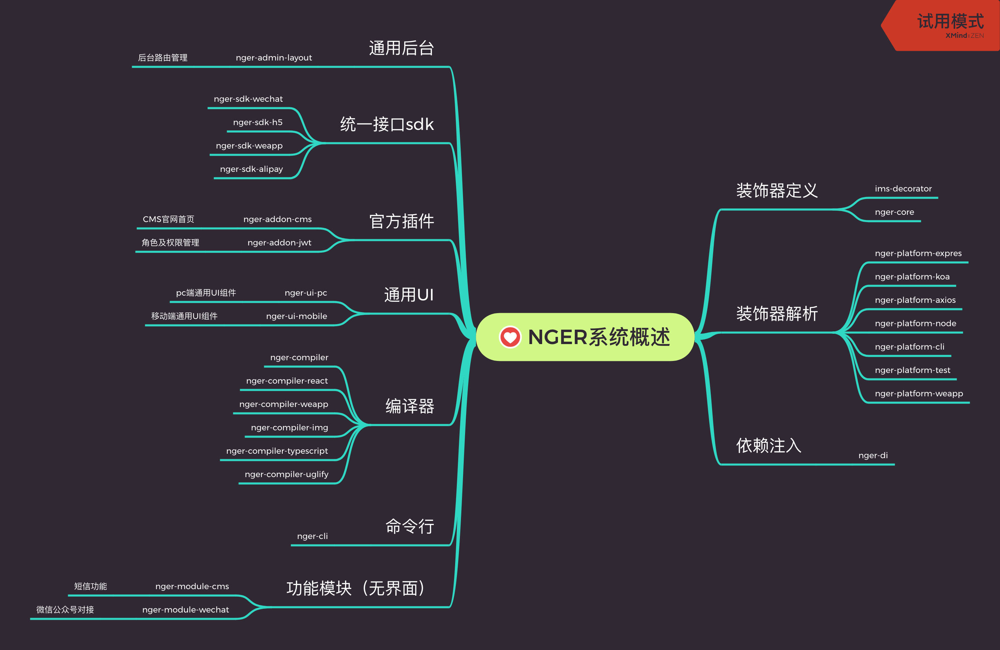

<p align="center"></p>

<h2 align="center">用ng自由组合开发小程序</h2>

> 项目名称意义，用ng的人！I am a nger! 

<font color="green">Warning!</font> <font color="green">Warning!</font> <font color="green">Warning!</font> 这不仅仅是一个前端项目。

vue、react相继都有了小程序的开发框架，作为一个nger，也该为社区做点事情了!
很遗憾，由于ng和小程序的差异性，我们暂时没打算直接把ng项目转换成小程序，而是用ng的一套思想（`依赖注入`、`装饰器`等）来规范开发小程序!以达到一套代码多平台运行。

技术栈说明：Typeorm/Nestjs/Angular/Ngrx/JSX/Injector(依赖注入)/Decorator(装饰器)/Webpack/Less/Sass/Gulp...

<h2 align="center">系统架构</h2>
<p align="center"></p>

> 用装饰器实现应用跨平台，如Controller装饰器，在前端就是发送http请求，在后端就是响应http请求
> 主要目标nger-compiler根据平台需求,选择性的去除或修改代码,nger-platform-*提供装饰器解析器。
> 将ng中的ngIf、ngFor通过编译器，拓展到其他运行环境，如小程序等。

<h2 align="center">依赖环境</h2>

1. [安装nodejs](https://nodejs.org/en/download/)
2. [安装docker](https://www.docker.com/products/docker-desktop)
3. [安装docker-compose](https://docs.docker.com/compose/install/)
4. npm install
5. docker-compose up -d
6. npm start

## 目录规范
- [addons 第三方插件目录](./addon)
- [attachment 附件目录](./attachment)
- [config 配置目录](./config)
  - [config.json 基础配置](./config/config.json)
  - [key.json 作者信息](./config/key.json)
- [data 数据目录,缓存，日志等](./data)
- [src 当前开发目录](./src)
  - [inc Controller存放目录](./src/inc)
  - [template 模板源码](./src/template)
  - [typeorm 数据库相关](./src/typeorm)
  - [admin.ts 后台管理入口](./src/admin.ts)
  - [app.ts 手机端管理入口](./src/app.ts)
  - [server.ts 服务端入口](./src/server.ts)
  - [package.json 模块信息](./src/package.json)
- [template 模板打包后存放目录](./template)

## 开发文档

- 核心概念
  - TypeContext 每个用装饰器装饰过得类都会有一个TypeContext,主要作用是查询装饰器参数。
  - NgModuleRef @NgModule装饰器装饰的类的运行时实例，每个NgModule在系统运行时创建
  - ComponentRef @Component装饰的类实例，需要NgModuleRef创建。
  - PipeRef @Pipe装饰的类实例，需要NgModuleRef创建。
  - DirectiveRef @Directive装饰的类实例，需要NgModuleRef创建。
  - PageRef @Page装饰的类实例，需要NgModuleRef创建。
  - ControllerRef @Controller装饰的类实例，需要NgModuleRef创建。
- 内置周期钩子
  - APP_INITIALIZER 系统初始化时运行，依赖注入还没有注册完毕，可在此时动态插入或替换某注入服务。并自动执行NgModule类中的构建方法。Platform需要注入此类型钩子，才能正常运行。
  - APP_ALLREADY APP_INITIALIZER所有钩子执行完毕后执行。这时依赖注入已准备完毕，所有服务可通过injector的方式获取。这个周期内，不要修改依赖注入服务。
## 核心思想
> ng的依赖注入

## 开发进度

### [nger-cli](./packages/nger-cli)
> 命令行工具
- [ ] `yarn cli build`构建打包
  - [ ] 手机h5 `yarn cli build h5`
  - [ ] pc网站 `yarn cli build pc`
  - [ ] 微信公众号 `yarn cli build wechat`
  - [ ] 微信小程序 `yarn cli build weapp`
  - [ ] 支付宝小程序 `yarn cli build alipay`
  - [ ] 百度智能小程序 `yarn cli build swap`
  - [ ] 字节跳动小程序 `yarn cli build tt`
  - [ ] ios客户端 `yarn cli build ios`
  - [ ] android客户端 `yarn cli build android`
- [ ] 初始化 `yarn cli init demo`
- [ ] `yarn cli init`初始化
- [x] `yarn cli test`单元测试
- [x] `yarn cli start`启动服务
- [ ] `yarn cli publish`发布到当前src模块应用商城

### [nger-core](./packages/nger-core)
> 核心库

- [x] angular装饰器
  - [x] [Component](https://www.angular.cn/api/core/Component)
  - [ ] [Directive 不支持](https://www.angular.cn/api/core/Pipe)
  - [x] [Pipe](https://www.angular.cn/api/core/Pipe)
  - [x] [Injectable](https://www.angular.cn/api/core/NgModule)
  - [x] [NgModule](https://www.angular.cn/api/core/NgModule)
  - [x] [ContentChild](https://www.angular.cn/api/core/ContentChild)
  - [x] [ContentChildren](https://www.angular.cn/api/core/ContentChildren)
  - [x] [ViewChild](https://www.angular.cn/api/core/ViewChild)
  - [x] [ViewChildren](https://www.angular.cn/api/core/ViewChildren)
  - [x] [Input](https://www.angular.cn/api/core/Input)
  - [x] [Output](https://www.angular.cn/api/core/Output)
  - [x] [HostBinding](https://www.angular.cn/api/core/HostBinding)
  - [x] [HostListener](https://www.angular.cn/api/core/HostListener)
  - [x] [Host](https://www.angular.cn/api/core/Host)
  - [x] [Inject](https://www.angular.cn/api/core/Inject)
  - [x] [SkipSelf](https://www.angular.cn/api/core/SkipSelf)
  - [x] [Self](https://www.angular.cn/api/core/Self)
  - [x] [Optional](https://www.angular.cn/api/core/Optional)
  - [x] [Attribute](https://www.angular.cn/api/core/Attribute)
- [x] [typeorm装饰器](https://github.com/typeorm/typeorm/blob/master/README-zh_CN.md)
  - [x] entity
    - [x] ChildEntity
    - [x] Entity
    - [x] TableInheritance
  - [x] columns
    - [x] Column
    - [x] CreateDateColumn
    - [x] ObjectIdColumn
    - [x] PrimaryColumn
    - [x] PrimaryGeneratedColumn
    - [x] UpdateDateColumn
    - [x] VersionColumn
  - [x] listeners
    - [x] AfterInsert
    - [x] AfterLoad
    - [x] AfterRemove
    - [x] AfterUpdate
    - [x] BeforeInsert
    - [x] BeforeRemove
    - [x] BeforeUpdate
    - [x] EventSubscriber
  - [x] relations
    - [x] JoinColumn
    - [x] JoinTable
    - [x] ManyToMany
    - [x] ManyToOne
    - [x] OneToMany
    - [x] OneToOne
    - [x] RelationCount
    - [x] RelationId
  - [x] transaction
    - [x] Transaction
    - [x] TransactionManager
    - [x] TransactionRepository
  - [x] tree
    - [x] Tree
    - [x] TreeChildren
    - [x] TreeLevelColumn
    - [x] TreeParent
  - [x] other
    - [x] Check
    - [x] EntityRepository
    - [x] Exclusion
    - [x] Generated
    - [x] Unique
- [x] nest装饰器
  - [x] `Get` (可选)发送`get`请求
  - [x] `Post` (可选)发送`post`请求
  - [x] `Controller` (可选)Api层，用于后端
- [x] 其他装饰器
  - [x] `Page` 页面
  - [x] `Command` (可选)命令行
  - [x] `Option` (可选)命令参数
  - [x] `It` (可选)单元测试
- [x] 生命周期
  - [x] `OnInit`
  - [x] `DoCheck`
  - [x] `OnDestroy`
  - [x] `AfterContentInit`
  - [x] `AfterContentChecked`
  - [x] `AfterViewInit`
  - [x] `AfterViewChecked`

## 生态
| 模块及文档连接                                         | 作用       |
|-------------------------------------------------|----------|
| [nger-module-gulp](./packages/nger-module-gulp) | gulp打包相关 |

## 任务安排
> 开发重点 nger-compiler 到 nger-di
> 目标src目录中的文件，编译到各个平台，并运行。

- [ ] 扫描项目目录，并记录每个文件导出的有装饰器装饰的类及名称。
- [ ] 根据运行目标，去掉没有用的或者可以去掉的一些内容，例如`@It`,`@Command`,`@Option`等
- [ ] `@Component`装饰的类生成对应的`Component(ComponentInstance)`
- [ ] `@Page`装饰的类生成对应的`Page(PageInstance)`
- [ ] 搜集配置信息生成`json`文件
- [ ] 编译`html`生成`wxml`文件
- [ ] 编译`scss`/`less`/`styl`生成`wxss`文件
- [ ] 编译生成`js`文件

## TODO

小程序适配思路

其实小程序和ng的适配度还蛮高的！
- @Component正好和Component对应。不唯一，可以有任意个实例
- App和NgModule对应。全局唯一
- @Directive和小程序的指令对应，这里有区别ng中可以自定义指令，小程序不行。不唯一。
- @Page和小程序的Page对应。全局唯一


### Controller
> 客户端运行时需要编译器转码
```ts
import { Controller, Get, Post } from 'nger-core'
@Controller({
    path: '/'
})
export class IndexController {
    info: any = {
        username: 'nger',
        age: 28
    }
    @Get()
    userInfo() {
        return this.info;
    }
    @Post()
    setUserInfo(username: string, age: number) {
        this.info = {
            username,
            age
        }
    }
}
// to
import { Get, Post, Controller } from 'nger-core'
@Controller({
    path: '/'
})
export class NgerUserController {
    @Get()
    userInfo: () => Promise<any>;
    @Post()
    setUserInfo: (username: string, age: number) => Promise<any>;
}
```


### @Page

// TODO
```ts
@Page({
    path: `pages/index/index`,
    template: `<view></view>`
})
export class ImsPage{}

// pages/index/index.js

// pages/index/index.json

// pages/index/index.wxss

// pages/index/index.wxml

```

### @Component

```ts
// **/ims-demo.ts
import {Component,Input,EventEmitter} from 'nger-core';

@Component({
    selector: 'ims-demo',
    template: `<view (onTap)="click"></view>`
})
export class ImsDemo {
    @Input()
    title: string;

    @Output()
    bindmyevent: EventEmitter;

    click(e){
        this.bindmyevent.emit(e);
    }
}

// to
// **/ims-demo.js
const instance = new ImsDemo();
Component({
    behaviors: [],
    data: {
        instance: instance
    },
    properties: {
        // Input
        title: instance.title
    },
    lifetimes: {
        created(){
            instance.ngOnInit()
        },
        attached() { 
            instance.onViewInit()
        },
        ready(){
            instance.onAfterViewInit()
        },
        moved() { 
            instance.onMoved()
        },
        detached() { 
            instance.onDestory()
        },
        error() { 
            instance.onError()
        },
    },
    pageLifetimes: {
        show(){
            instance.onShow()
        },
        hide(){
            instance.onHide()
        },
        resize(){
            instance.onResize()
        }
    },
    methods: {
        click: instance.click
    }
})
// **/ims-demo.json
{}
// **/ims-demo.wxss

// **/ims-demo.wxml
<view onTap="click"></view>
```

### ngIf


```html
<ng-template [ngIf]="condiction"></ng-template>
<!-- to -->
<ng-template wx:if="{{condiction}}"></ng-template>
```

```html
<ng-template [ngIf]="condiction" [ngIfELse]="elseBlock">condiction</ng-template>
<ng-template #elseBlock>elseBlock</ng-template>
<!-- to -->
<ng-template wx:if="{{condiction}}"></ng-template>
<ng-template wx:else>elseBlock</ng-template>
```

```html
<ng-template [ngIf]="condiction" [ngIfThen]="thenBlcok" [ngIfELse]="elseBlock"></ng-template>
<ng-template #thenBlcok>thenBlcok</ng-template>
<ng-template #elseBlock>elseBlock</ng-template>
<!-- to -->
<ng-template wx:if="{{condiction}}">thenBlcok</ng-template>
<ng-template wx:else>elseBlock</ng-template>
```

### ngFor

```html
<ng-template ngFor let-item="it" let-i="index" [ngForOf]="items"></ng-template>
<!-- to -->
<ng-template wx:for="items" wx:for-item="it" wx:for-index="i"></ng-template>
```

## 多平台SDK统一接口

```ts

```


### [nger-platform-test](./packages/nger-platform-test)
> 用于启动测试

### [nger-platform-cli](./packages/nger-platform-cli)
> 用于启动cli

### [nger-platform-express](./packages/nger-platform-express)
> express环境

### [nger-platform-koa](./packages/nger-platform-koa)
> express环境

### [nger-platform-typeorm](./packages/nger-platform-typeorm)
> typeorm环境

### [nger-platform-weapp](./packages/nger-platform-weapp)
> 小程序运行

### [nger-di](./packages/nger-di)
> 依赖注入实现

### [nger-logger](./packages/nger-logger)
> 带色打印工具

- [x] Logger 接口
- [x] `ConsoleLogger` `Logger`的`console`实现


## 资助

<p></p>
